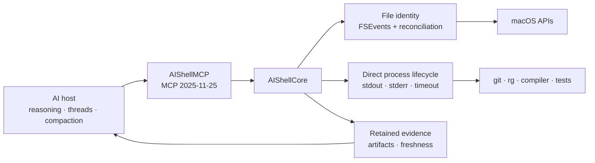

<p align="center">
  
</p>

# AIShell

[](https://github.com/kitepon/aishell/actions/workflows/ci.yml)
[](https://www.npmjs.com/package/@quolu/aishell)


> AI開発hostへfreshなworkspace state、budget付きcontext、保持された実行証拠を渡すmacOS-native MCP runtime。すべての操作をshell文字列へ潰さず、OSに面する状態をモデルより下で所有する。

[English](README.md)

[kitepon.dev](https://kitepon.dev/)を運営する[クオ（@QLyun35332）](https://x.com/QLyun35332)が
開発・メンテナンスしています。

**所有境界:** 本repositoryはApple Silicon Mac向けruntimeのinstall、設定、
state/schema migration、診断、復旧、更新、releaseを単独で所有します。
[dotagents](https://github.com/kitepon/dotagents)は公開contractを使って製品横断wireと
互換性を統合しますが、AIShellの内部運用を制御しません。

AIShellはfile identity、filesystem照合state、直接起動したprocess、完全log、artifactを所有する。reasoning、thread、compaction、sub-agent、汎用terminalはAI hostの責務として残す。

## 30秒で試す

Apple Silicon Mac、macOS 15以降が必要。

```sh
npm install -g @quolu/aishell && aishell-setup
```

フォルダの事前登録は不要。新しいCodex taskで対象フォルダを指定して実行する。

```text
初回workspace contextはworkspace_snapshotで取得して。focused testはrun_checkで実行し、
summaryから省略された証拠だけartifact_readで読んで。
```

既定profileは5本の高密度development tool、実行状態と管理画面の旧入口を提供する。

| Tool | 役割 |
|---|---|
| `workspace_snapshot` | boundedな初回preview、照合済み変更delta、Git状態、主要context |
| `read_context` | SHA-256 identityとcontinuationを持つbudget付き複数file read |
| `search_context` | 直接起動した`rg` workerによるbudget付き検索context |
| `run_check` | 直接process実行、主要diagnostic、完全stdout/stderr artifact |
| `artifact_read` | 保持artifactのrange、tail、pattern周辺read |
| `runtime_status` | 実行状態と相対パスの基準 |
| `runtime_open_manager` | 互換用の旧入口。管理UIの廃止を`MANAGER_REMOVED`で返す |

MCP serverへ`AISHELL_CAPABILITY_SET=expanded-v1`を設定すると、candidate surfaceへ明示opt-inできる。
高密度development 9本、実行状態と管理画面の旧入口を公開し、`run_observe`、`workspace_wait`、
`change_impact`、`apply_change_set`を追加する。既存toolにもmanaged run、artifact query、
semantic search、project profile、Git branch/worktree modeが加わる。

Codexでは次のように登録する。

```sh
aishell-setup --ai codex
```

未知値または空の`AISHELL_CAPABILITY_SET`と`AISHELL_TOOL_PROFILE`はtyped errorでstartup停止し、
別profileへ黙ってfallbackしない。

lexical `search_context`は`ranking`を省略できる。workspace cursorなしではtest path、
`changed_since_cursor`ありでは変更pathとtest pathを優先する。`changed`を明示する場合だけcursorを必須とする。

## なぜAIShellか

statelessな連携では、モデルがworkspaceを何度もscanし、command出力から状態を再構成しやすい。AIShellは状態を持つOS側の仕事をモデルより下へ置き、後続turnが全再scanではなくdeltaと一次証拠を要求できるようにする。

| 論点 | AIShell | 一般的なshell-first連携 |
|---|---|---|
| Workspace state | file identity＋filesystem観測と照合 | commandを再実行してtextから再構成 |
| Context | budget・cursor付きstructured result | stdoutを手動または暗黙に切り詰める |
| Execution | executable URL、引数、cwd、lifecycleを分離 | shellが1本のcommand文字列を評価 |
| Evidence | 完全stdout/stderrを期限付きhandleで保持 | response truncation時に証拠が失われやすい |
| Scope | macOSのアクセス権 | 周囲のshellとhost policyに依存 |

AIShellはsandboxではなく、任意code実行を安全化しない。process railの目的はtyped executionと観測可能なlifecycleを維持することであり、改名binaryや許可workerが起動する子processを阻止することではない。

## Architecture



`AIShellCore`がdomain挙動を所有し、`AIShellMCP`はprotocol request/resultだけを変換する。Git、ripgrep、compiler、test、SourceKit-LSPは新しいstate ownerにせず、直接起動するworkerとして再利用する。

## npmからinstall

global packageは`aishell-mcp`、`aishell-setup`を`PATH`へ追加する。npm install自体ではスクリプトも管理アプリも起動しない。

対象AIのCLI（`claude`、`codex`、`grok`、Cursorの`agent`）を先に導入する。setupは各CLIからの読戻しも確認する。

`aishell-setup`は導入済みのClaude Code・Codex・Grok Build・Cursorを検出し、MCP登録、設定の読戻し、実際のMCP操作まで確認する。登録はbare `aishell-mcp`＋`AISHELL_CAPABILITY_SET=expanded-v1`。利用者のenv、PATH、他の設定を保持する。`--ai`で対象を指定でき、`--check`は設定を変更せず診断する。Windows/LinuxとIntel Macは対象外。詳細は[製品単体の導入契約](https://github.com/kitepon/aishell/blob/main/docs/setup.md)を参照。

更新後も同じ`aishell-setup`を実行する。登録保持・読戻し・MCP実操作まで確認する。管理UIとKeychain認証は不要。接続済みのMCPは、hostで再接続すると新版へ切り替わる。

```sh
npm install -g @quolu/aishell && aishell-setup
```

現在の実験版はDeveloper ID署名・notarization前である。

## Sourceからbuild

```sh
git clone https://github.com/kitepon/aishell.git
cd aishell
swift test
npm run build:npm
```

実行ファイルは`dist/aishell-mcp`と`dist/aishell-run-supervisor`へ生成する。

フォルダ登録は不要。絶対パスは指定した場所を、相対パスと省略時はMCP起動ディレクトリを基準にする。Git worktreeも直接指定でき、旧設定の許可フォルダ一覧は無視される。

## 別のAI hostへ接続

global npm install後は`PATH`上のcommand名とexpanded development surfaceを登録する。

```sh
aishell-setup --ai claude,codex,grok,cursor
aishell-setup --check
```

解除:

```sh
codex mcp remove aishell
```

expanded capability未指定時の互換用full profileは全25 toolを提供する。既定7本は5本の
development toolと実行状態と管理画面の旧入口で、full modeは残りのlegacy primitiveも公開する。
`expanded-v1`ではdevelopment 11本、full 29本を公開する。

```sh
AISHELL_TOOL_PROFILE=full /opt/homebrew/bin/aishell-mcp
AISHELL_CAPABILITY_SET=expanded-v1 AISHELL_TOOL_PROFILE=full /opt/homebrew/bin/aishell-mcp
```

full profileにはfile一覧・read、SHA-256競合検出付きatomic update、copy/move/rename/Trash、直接process実行、app discovery/launch、runtime statusが含まれる。

`apply_change_set`は編集状態を通常のJSONとして保存し、新しい暗号鍵や所有者証明を作らない。競合検出、差分、再起動後の継続を維持する。
ローカル鍵を使っていた旧版の記録は必要になった時に読み取り、通常の編集で更新する記録から平文へ切り替える。旧鍵や履歴の一括削除は行わない。
使用ログは`~/Library/Application Support/AIShell/activity.jsonl`へ保存する。詳しくは[導入契約](https://github.com/kitepon/aishell/blob/main/docs/setup.md)を参照。

## 実行と安全性の境界

- shell command文字列を評価しない。開発programを`PATH`からexecutable URLへ解決し、arguments、environment、working directoryと分離する。
- `sh`、`bash`、`zsh`、`env`、`osascript`等のbasename直接起動を製品上のrailとして拒否する。security boundaryとして宣伝しない。
- `run_check`はopen-world capabilityであり、許可workerはfile更新・子process・network accessを行い得る。AI hostによっては実行承認が必要になる。
- text更新はSHA-256または旧textを事前条件にできる。削除はTrashへ送る。
- 管理UIと停止設定は廃止した。旧`runtime.json`は操作の条件にしない。

## 現在の制限

- stdio requestは復旧操作・読み取り・実行の3系統で処理する。読み取りと復旧操作は長時間の実行中も応答するが、実行系requestは直列化する。
- MCPの`notifications/cancelled`を受け付ける。管理対象processの明示的な停止は`run_observe`の`cancel`で行う。
- timeout時は直接所有するprocess treeを終了するが、終了までに許可workerがopen-worldな副作用を起こし得る。
- 初回workspace entryはbounded previewで、後続deltaはcursor pageになる。
- Developer ID署名とnotarizationは未設定。

## 運用・更新・release

単独installの更新は初回と同じ公式npm経路とsetupを使う。

```sh
npm install -g @quolu/aishell@latest && aishell-setup
```

`runtime_status`で実行状態を確認できる。管理UIは廃止済み。
工場consumerは専用`AISHELL_TOOL_PROFILE=factory` MCP surfaceから
`factory_diagnostics`を呼ぶ。schemaとprivacy境界は
[製品側diagnostics contract](https://github.com/kitepon/aishell/blob/main/docs/factory-diagnostics.md)が正である。

公開はGitHub Actionsの[公開workflow](https://github.com/kitepon/aishell/blob/main/.github/workflows/publish.yml)から行う。
`AIShellProduct.version`と`package.json`の版を揃え、`docs/archive/releases/`へrelease notesを追加し、変更をmainへ反映する。
そのcommitに対応する版タグを送ると、配布物の検査、npmへの直接公開、GitHub Release作成まで自動で進む。

```sh
git tag "v$(node -p 'require("./package.json").version')"
git push origin "v$(node -p 'require("./package.json").version')"
```

npmには`kitepon/aishell`の`publish.yml`をTrusted Publisherとして登録し、`npm publish`を許可する。
公開jobはGitHub管理のMacで動き、OIDCで自動認証する。長期npm tokenと公開ごとのTouch IDは不要。
通常CIの別runを待つgateは持たず、既定ブランチへの反映と配布物を公開job自身が確認する。
`prepublishOnly`を明示実行してから公開するため、lifecycleによる同じビルドの再実行も行わない。

公開後は標準の更新入口で導入する。

```sh
npm install -g @quolu/aishell@latest && aishell-setup
```

`aishell-setup --check`と工場診断で導入結果を確認する。既存MCPは再接続または新しいセッションで新版へ切り替わる。
初回のTrusted Publisher設定変更時にnpmが要求する本人認証は別途必要になる。

## 開発検証

```sh
swift test
npm run build:npm
```

実装は`Sources/AIShellCore`、`Sources/AIShellMCP`、`Sources/AIShellRunSupervisor`に置き、SwiftPMでbuildする。

## ContributionとSecurity

変更提案前に[CONTRIBUTING.md](https://github.com/kitepon/aishell/blob/main/CONTRIBUTING.md)を確認してほしい。脆弱性はpublic issueへ書かず、[SECURITY.md](https://github.com/kitepon/aishell/blob/main/SECURITY.md)のprivate経路で報告する。

現役文書の索引は[`docs/README.md`](https://github.com/kitepon/aishell/blob/main/docs/README.md)、過去のrelease notesは
[`docs/archive/releases/`](https://github.com/kitepon/aishell/tree/main/docs/archive/releases)に置く。

## License

AIShellは[Apache License 2.0](LICENSE)で公開している。
